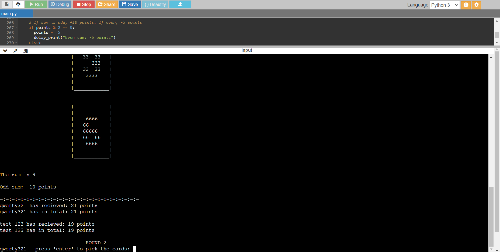

# Random Card Game

## Program in action:
https://youtu.be/UU31cP--v1Y

Picks from 8 random cards from 0-7 for each player and adds or subtracts points based on odds, evens and doubles.

### Future update ideas:
 - Leaderboard 
 - More colours
 - Ability to change the number of players and the number of cards picked each time
 - Cleaner/better-optimised code
 
